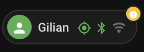

# Person Card

A compact Home Assistant Lovelace chip for a `person.*` entity. Shows an
avatar, whether the person is home, and which device-tracker source last
placed them there (GPS / Bluetooth / Wi-Fi). Tapping it opens a built-in
detail popup — no separate popup card needed — listing every linked device
tracker plus, optionally, a colour-coded list of active severity alerts from
any set of sensors (pollen, air quality, anything with a numeric level).

<p align="center">
  
</p>

The card's own text (tracker states, popup section labels, relative
timestamps) follows the Home Assistant frontend's current language, with
English and German built in; anything not covered falls back to English.

## Installation

### HACS (custom repository)

1. HACS → the three-dot menu → Custom repositories.
2. Add `https://github.com/Gr33ndev/ha-person-card` with category
   **Lovelace**.
3. Install "Person Card", then hard-refresh your browser.

### Manual

1. Download `person-card.js` from the latest release.
2. Copy it into `config/www/`.
3. Add it as a dashboard resource: Settings → Dashboards → Resources →
   `/local/person-card.js`, type **JavaScript Module**.

## Configuration

| Option | Type | Default | Description |
| --- | --- | --- | --- |
| `person_entity` | string | **required** | The `person.*` entity to show. |
| `name` | string | entity's friendly name | Override the displayed name. |
| `badge_entities` | list | `[]` | Entities whose active severity levels drive the badge dot and the "Alerts" section of the popup. See below. |
| `badge_label` | string | — | A Home Assistant Label ID. Every entity currently carrying this label is added to the badge candidates automatically — see below. |
| `badge_max_level` | number | `4` | The top of the severity scale used for badge colours. |
| `disable_popup` | boolean | `false` | Open Home Assistant's native more-info dialog on tap instead of the built-in popup. |

```yaml
type: custom:person-card
person_entity: person.jane
badge_entities:
  - sensor.pollen_birch
  - sensor.pollen_ash
```

The badge dot stays hidden whenever no configured entity is currently above
level 0, or when `badge_entities`/`badge_label` are both omitted.

### `badge_label`: fully dynamic badges

Instead of (or in addition to) listing entities by hand, point the card at a
[Label](https://www.home-assistant.io/docs/organizing/labels/) and it resolves
the matching entities itself, live, on every update:

```yaml
type: custom:person-card
person_entity: person.jane
badge_label: jane
```

Tag any sensor with the `jane` label (Settings → Entities → pick the entity →
Label) and it immediately shows up on Jane's card — no dashboard or card edit.
Untag it and it's gone. This is the way to go when the set of relevant
entities changes over time (which pollen sensor matters for which person,
which alert applies to which room, …): manage membership entirely through
Home Assistant's own Label UI, and automations can keep labels in sync with
whatever your actual source of truth is (an `input_select`, a schedule, …) via
the built-in `homeassistant.add_label_to_entity` / `remove_label_from_entity`
actions.

Requires a frontend that exposes entity registry labels via `hass.entities`
(Home Assistant 2024.9+).

### `badge_entities` in detail

Each entry is either a plain entity ID or an object:

| Field | Description |
| --- | --- |
| `entity` | **required.** The sensor to read a severity level from. Detection order: a `numeric_state`/`level`/`pollen_level`/`index`/`value` attribute, or the primary state if it's a plain number. |
| `name` | Override the label shown in the popup (default: the entity's `friendly_name`). |
| `icon` | Override the icon shown for this entry (default: the entity's own `icon` attribute, then `mdi:alert-circle`). |
| `filter_entity` | Optional. Another entity whose current state gates this one in. |
| `filter_state` | Required together with `filter_entity`: the state `filter_entity` must currently hold for this entry to count. |

When the entity also has a `named_state`/`level_name`/`state_text` attribute
(a human-readable severity word, as many level-based sensors provide), it's
shown as small secondary text under the name — e.g. an allergen sensor row
reads "Ragweed" with "moderate" underneath, rather than just the raw word.

`filter_entity`/`filter_state` make a *listed* entry conditional on something
else in your setup, without needing a Label for it — for example a sensor
that should only count while an `input_select` is set to a particular value:

```yaml
badge_entities:
  - entity: sensor.pollen_birch
    name: Birch
    icon: mdi:tree-outline
    filter_entity: input_select.pollen_alert_for
    filter_state: Jane
```

### Device-tracker sources

The three source icons (GPS, Bluetooth, Wi-Fi) light up based on the
`device_trackers` attribute of the person entity: each tracker's
`source_type` attribute (`gps`, `bluetooth_le`/`bluetooth`, `router`) decides
which icon it feeds, and the icon is highlighted when that tracker's own
state is `home`. The same list, with per-tracker state and last-updated
time, appears in the popup.

## License

MIT — see [LICENSE](LICENSE).
